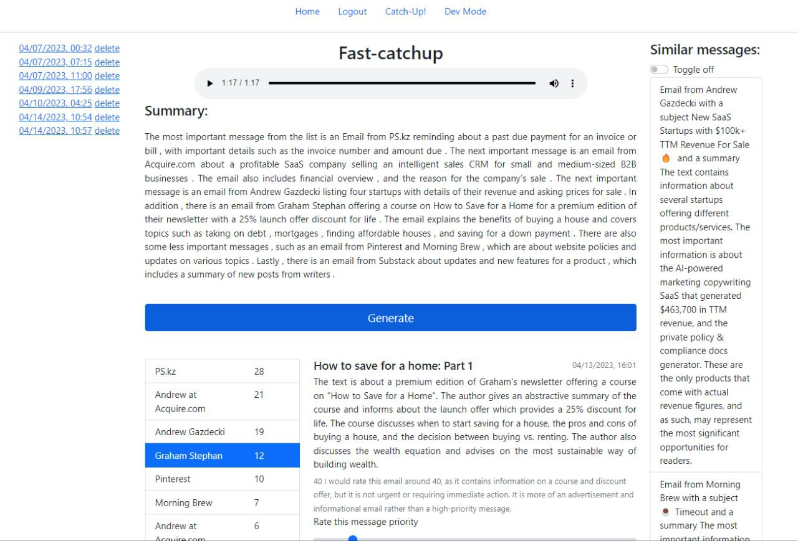

# FAST CATCH-UP

This is the proof-of-concept interface of an app that:
1. Retrieve pipeline of various platform messages, emails and other signals, manage their credentials etc.
2. Assign each message a priority score based on prompt, context and few-shots of similar messages and their priority. 
3. Each priority score is provided with model justification of a score. 
3. Collect a priority lists for each platform and combine all messages by their final priority score
4. Generate a 1-2 minute narrated audio with most important messages from priority list 
5. Send user interface to see email summaries, scores, justifications and allow to adjust scores. 

